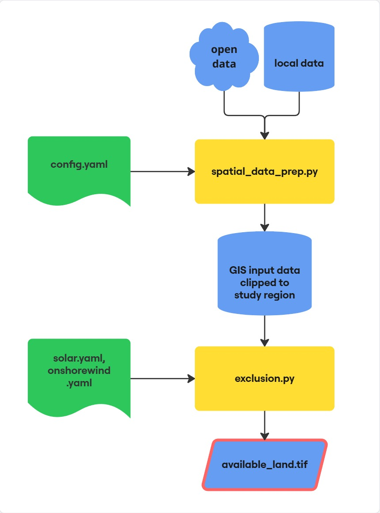

# Basic Workflow
Basic workflow --> identify available land (no timeseries data)

This guide walks through the end-to-end workflow for running the Land Availability Analysis (LAVA)
tool on a new study region. The steps below assume that you have already cloned the repository, created the
`lava` environment and finished the data setup. Those steps are documented in the [Getting Started](getting_started.md) instructions.

## Overview of the basic workflow

1. Create the study-region configuration files in `configs/`.
2. Run `spatial_data_prep.py` to download and prepare necessary data.
3. Inspect the pre-processed data (optional but recommended) with `data_explore.ipynb`.
4. Run `Exclusion.py` for each technology to create available-land rasters.

{ width="50%" }

{ width="50%" }

*Figure: Flowchart of the basic workflow*

## Configuration files

In the **configs-folder** copy the file `config_template.yaml`, rename it to `config.yaml` and fill it out. This is your main configuration file for the data download.
Under the headline *#--exclusions--* in the configuration the variables **scenario** and **technology** are used to control the available land output.

For the exclusion criterias copy the files `onshorewind_template.yaml` and `solar_template.yaml`. Rename them to `onshorewind.yaml` and `solar.yaml` respectively. Fill these files out in order to set the exclusion parameters.

!!! note 
    An overview of possible exclusion criterias found in selected literature can be downloaded [here](../assets/literature_overview.xlsx).

## Prepare data

Run the preprocessing script `spatial_data_prep.py` after having filled out `config.yaml`. It downloads data, clips the raw inputs to the
study area, aligns rasters, and computes helper layers such as slope, terrain ruggedness, and
proximity rasters. All outputs are written to a study region specific folder **data/{RegionName}/**.

Click on the play button to run the script or run it from the terminal with the following command:
```bash
python spatial_data_prep.py
```

When `landcover_source` is `openeo` the script will prompt for Copernicus Data Space credentials the first time it runs.

## Inspect data inputs

Use `data_explore.ipynb` to verify the preprocessing results. The notebook loads data from the
**data/{RegionName}/** folder, visualises selected layers, and summarises the available land-cover
codes to support tuning of exclusion thresholds.

## Land eligibility exclusions

Create technology-specific available-land rasters by running `Exclusion.py`. The command-line
flags mirror the configuration entries so that single technologies or scenarios can be processed
independently. Alternatively you can specify in `config.yaml` under the headline *#--exclusions--* the variables "scenario" and "technology". There are configuration files for the land exclusion for wind onshore and utility-scale solar PV.
```bash
python Exclusion.py --technology solar --scenario ref
```
```bash
python Exclusion.py --technology onshorewind --scenario ref
```

The script loads the prepared rasters and vector layers, applies the filters defined in the
technology configuration, and writes `*_available_land_*.tif` files under
**data/{RegionName}/available_land/**. A log of each scenario run is stored in the region folder
for traceability.

!!! note 
    A template to document the exclusion parameters and data sources can be downloaded [here](../assets/exclusion_parameters_overview.xlsx).

## Batch processing with Snakemake

When analysing multiple study regions, you can use a snakemake workflow to automatically execute all scripts for all regions one after another. Adjust `config_snakemake.yaml` and run the batch job with the following comamand in the terminal:
```bash
snakemake -s snakemake/Snakefile --cores 1 --resources openeo_req=1
```

You can parallelize by using multiple cores. You can use a maximum of 2 openeo_req to download the landcover data.