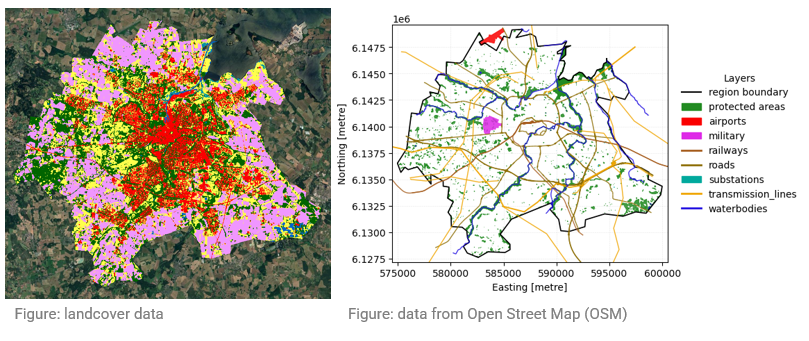
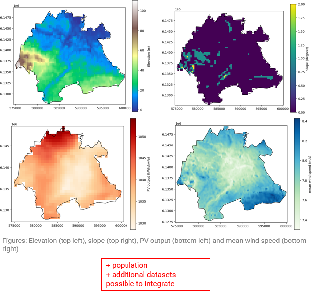
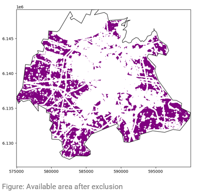

---
hide:
  - toc
---

# LAVA Documentation

Welcome to the **LAVA** documentation. This documentation provides a comprehensive guide on how to set up and use the LAVA workflow.
You can find the LAVA GitHub repository [here](https://github.com/DEA-GE/LAVA).
The LAVA tool is research software which means the user needs to interact with the terminal and some configuration files. While the tool needs careful handling, it is highly flexible.
For user-friendly online GIS tools to identify available land have a look at [Energy Access Explorer](https://www.energyaccessexplorer.org/tool/s/) and [REZoning](https://rezoning.energydata.info/).

## Example: Odense in Denmark
Below you can find the default input data used in LAVA for the region *Odense* in Denmark.

All input data is overlaid and all areas which cannot be used are excluded (e.g. roads, urban areas, waterbodies, …). The remaining area is the available area for renewable energy generators.

