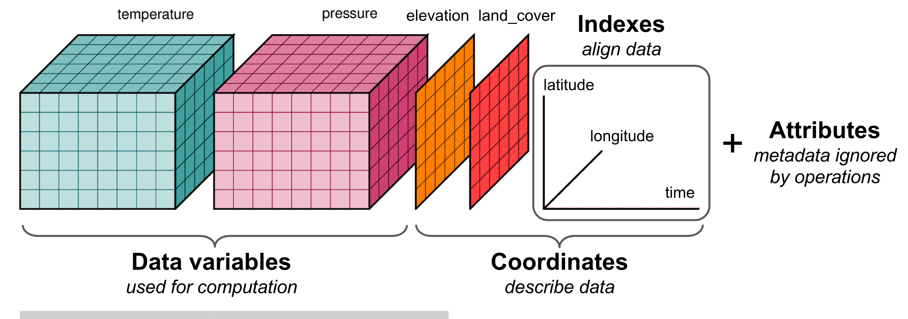

# Reanalysis

## What is reanalysis?
Reanalysis data provide the most complete picture currently possible of past weather and climate. They are a blend of observations with past short-range weather forecasts rerun with modern weather forecasting models. They are globally complete and consistent in time and are sometimes referred to as ‘maps without gaps’.

## Why use it?
Reanalysis data has multiple advantages, e.g. global coverage, which enables simulation at any location, facilitating simulation of future wind and solar farms. Another advantage is that the data spans multiple decades in the past, which enables simulation of extreme cases. And finally, it contains correlated and physically coherent data for other weather variables like irradiance, surface temperature, precipitation etc. which can be used to model other key components of power systems like hydro and demand - all of which in combination can create a comprehensive input for energy system studies. This helps in maintaining correlations among other variables and also enables the study of system-level weather impacts on future energy systems.

## netCDF: data format for gridded data

*Figure: Dataset diagram from [xarray documentation](https://docs.xarray.dev/en/stable/user-guide/data-structures.html)*

